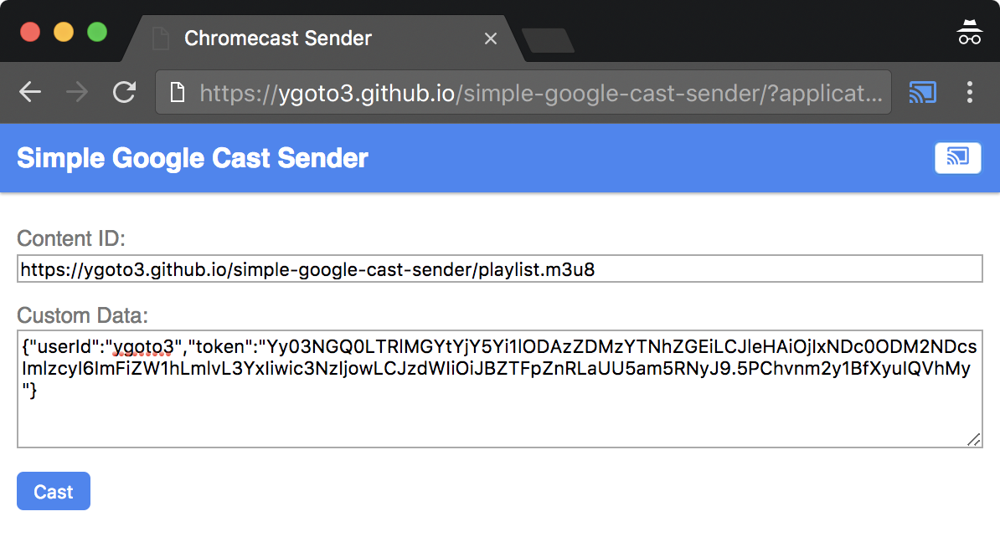

# simple-google-cast-sender
A simple sender application running on Google Chrome.  It simply casts media to a Google Cast device or Chromecast.

Usage
---

1. Open Google Chrome.
1. Go to [https://ygoto3.github.io/simple-google-cast-sender/?applicationId=YOUR_APPLICATION_ID](https://ygoto3.github.io/simple-google-cast-sender/?applicationId=YOUR_APPLICATION_ID) (Set your application id to a query string parameter `applicationId`).
1. Connect to a Google Cast device or Chromecast by clicking the Google Cast button at the top right corner.
1. Enter a content ID, which is a playlist url like HLS's m3u8 or MPEG-DASH's MPD.
1. Optionally enter custom data in JSON format.
1. Click the "Cast" button at the bottom left corner.
